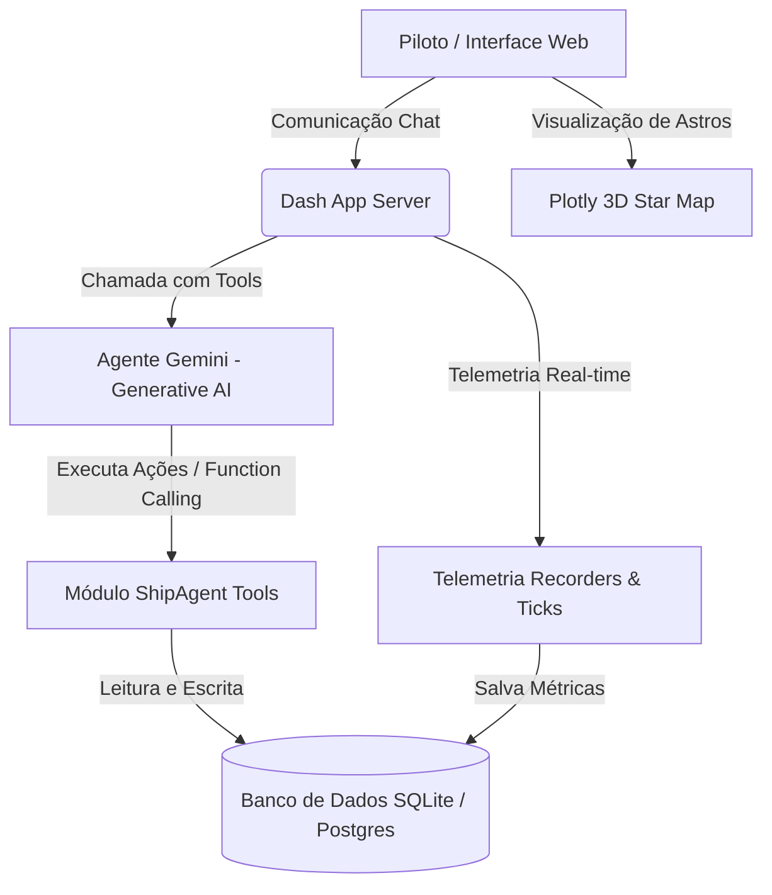

# 🛸 SaaS Antigravity Space — Nave Planetária

> **Plataforma Cockpit com Agente de IA Co-Piloto Científico e Telemetria Orbital em Tempo Real**

[](https://www.python.org/)
[](https://dash.plotly.com/)
[](https://ai.google.dev/)
[](LICENSE)

A **Nave Planetária** é uma plataforma SaaS gamificada de exploração científica e simulação espacial. Ela apresenta uma interface de cockpit moderna no estilo glassmorphism que rastreia dados simulados da Estação Espacial Internacional (ISS) em tempo real, renderiza um mapa estelar interativo em 3D e integra um **Agente de IA Co-Piloto Científico** autônomo. 

Desenvolvido como o **Projeto Final** demonstrando o uso avançado de agentes de IA com tomadas de decisão, histórico contextual e execução de ferramentas (*Function Calling*).

---

## 🌟 Funcionalidades Principais

* **🌌 Visualizador Celeste 3D:** Mapa espacial interativo renderizado em Plotly 3D que permite rotacionar, aproximar e selecionar estrelas e planetas no espaço tridimensional.
* **📊 Painel de Telemetria Orbital:** Rastreamento em tempo real da rota de voo (coordenadas de latitude/longitude inspiradas na ISS), altitude (km) e velocidade relativa (km/h) com atualização via intervalos de tempo (ticks).
* **🤖 Co-Piloto Científico com IA (Gemini):** Chat operacional avançado integrado com a API do Google Gemini com suporte a **Function Calling (Tools)**. O agente de IA pode agir autonomamente na nave:
  * Consultar e analisar as estatísticas de voo e telemetria da nave.
  * Buscar informações científicas detalhadas de estrelas e planetas diretamente do banco de dados.
  * Registrar observações de astros no diário de bordo sob comando em linguagem natural.
  * Listar, iniciar ou completar missões científicas do piloto de forma independente.
* **📝 Briefing Dinâmico de Bordo:** Relatório dinâmico gerado em tempo real pela IA na entrada do cockpit analisando a situação de combustível, altitude média, logs recentes de voo e a patente do piloto.
* **🎖️ Diário de Bordo & Gamificação:** Registro de observações científicas e missões concluídas que bonificam o piloto com XP, promovendo-o em diferentes patentes militares espaciais (Cadete, Tenente, Comandante).
* **🔒 Segurança SaaS Completa:** Sistema de autenticação de usuários, hash de senhas (bcrypt), sessões ativas com controle e preferências do painel (temas).

---

## 🛠️ Arquitetura do Sistema

O projeto adota uma arquitetura SaaS modular escrita em Python, utilizando **Flask** como servidor web seguro e **Dash** para a renderização reativa do dashboard.



---

## 🚀 Como Executar o Projeto Localmente

### Pré-requisitos
* Python 3.10 ou superior instalado.
* Uma chave de API da Google Gemini (obtenha gratuitamente no [Google AI Studio](https://aistudio.google.com/)).

### 1. Clonar o Repositório e Criar Ambiente Virtual
```bash
# Clone o repositório
git clone https://github.com/seu-usuario/nave-planetaria-plataform.git
cd nave-planetaria-plataform

# Crie o ambiente virtual
python -m venv .venv

# Ative o ambiente virtual
# No Windows (PowerShell):
.\.venv\Scripts\Activate.ps1
# No Linux/macOS:
source .venv/bin/activate
```

### 2. Instalar as Dependências
```bash
pip install -r requirements.txt
```

### 3. Configurar as Variáveis de Ambiente
Crie um arquivo `.env` na raiz do projeto baseado no `.env.example`:
```env
FLASK_SECRET_KEY=sua-chave-secreta-flask
DEBUG=True
PORT=8050

# Configure a sua chave do Gemini para habilitar o agente de IA completo
GEMINI_API_KEY=SUA_CHAVE_REAL_DO_GEMINI_AQUI
```

### 4. Inicializar o Banco de Dados e Rodar a Aplicação
O sistema cria e popula automaticamente o banco de dados SQLite local no primeiro boot se ele não existir.
```bash
# Opcional: inicializar o banco de dados manualmente
python init_db.py

# Iniciar o servidor local da nave
python app.py
```
Acesse o painel em: `http://127.0.0.1:8050/`

### 🔑 Credenciais Padrão (Semeadas)

Para fazer o login e testar a plataforma, você pode utilizar um dos usuários padrão criados na inicialização do banco:
* **Usuário Comum (Piloto):**
  * **Usuário:** `comandante`
  * **Senha:** `1234`
* **Usuário Administrador:**
  * **Usuário:** `admin`
  * **Senha:** `nave2026`


---

## 🤖 Como Interagir com o Co-Piloto no Cockpit

Quando o servidor estiver rodando e a chave `GEMINI_API_KEY` estiver configurada, o chat no menu **Cockpit & Co-Pilot** passará a ser controlado pelo Agente Inteligente. Você pode testar comandos em linguagem natural como:

* **Consulta Geral:** *"Como está a nossa velocidade média de voo e a altitude de órbita?"* 
  *(A IA chamará a ferramenta de telemetria e lerá os registros dinâmicos)*
* **Consulta de Astros:** *"Busque no catálogo dados da estrela Sirius."*
* **Ação Combinada (Agência):** *"Gostei de Sirius. Registre a observação dela no meu diário de bordo, por favor."*
  *(O Agente irá buscar Sirius, registrará a observação em seu nome no banco de dados e você receberá +50 XP no mesmo instante)*
* **Gerenciamento de Missões:** *"Quais missões estão ativas?"* ou *"Inicie a missão de analisar radiação."*

*Nota: Se a chave do Gemini não for inserida no `.env`, o sistema executará em **Modo Fallback Offline** de forma segura, respondendo via regras de palavras-chave pré-programadas para garantir a estabilidade do painel.*

---

## 📁 Estrutura de Pastas Operacional

```text
nave-planetaria-plataform/
│
├── database/                   # Definição e arquivos do banco de dados (SQLite)
│   ├── schema.sql              # Esquema SQL relacional da plataforma
│   └── init_db.py              # Script de população e migração inicial
│
├── src/                        # Código fonte da plataforma
│   ├── ai/
│   │   ├── core.py             # Motor do Briefing de IA do Cockpit
│   │   ├── agent.py            # Motor do Agente Gemini e definições de Tools
│   │   └── advisors.py         # Fallback de regras científicas locais
│   │
│   ├── auth/                   # Autenticação de usuários e rotas de login
│   ├── api/                    # Funções de interface direta com o Banco de Dados
│   ├── missions/               # Engine de missões e catálogo acadêmico
│   ├── user/
│   │   └── dashboard.py        # Layouts Dash e lógica de Callbacks reativos
│   └── telemetry/              # Simulador de telemetria espacial (ISS)
│
├── app.py                      # Arquivo principal de execução do servidor
├── requirements.txt            # Dependências do Python
└── .env                        # Variáveis de ambiente e segredos
```

---

## 🛡️ Licença

Este projeto está licenciado sob a licença MIT. Consulte o arquivo `LICENSE` para obter mais detalhes.

---
*Manobre com segurança, piloto. A IA de bordo está pronta para auxiliar nas suas decisões interestelares.* 🌌🚀
